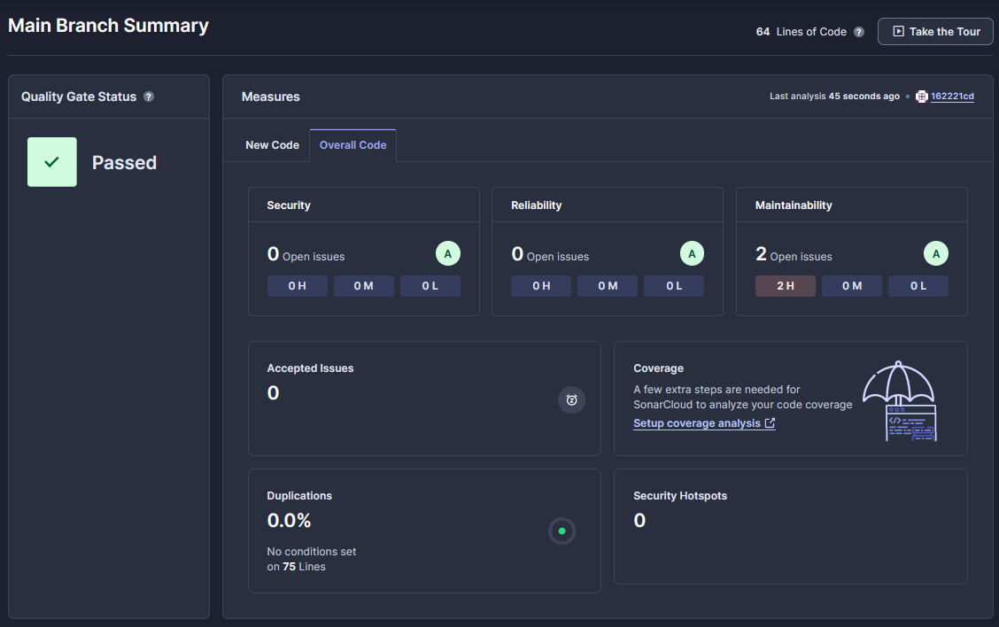
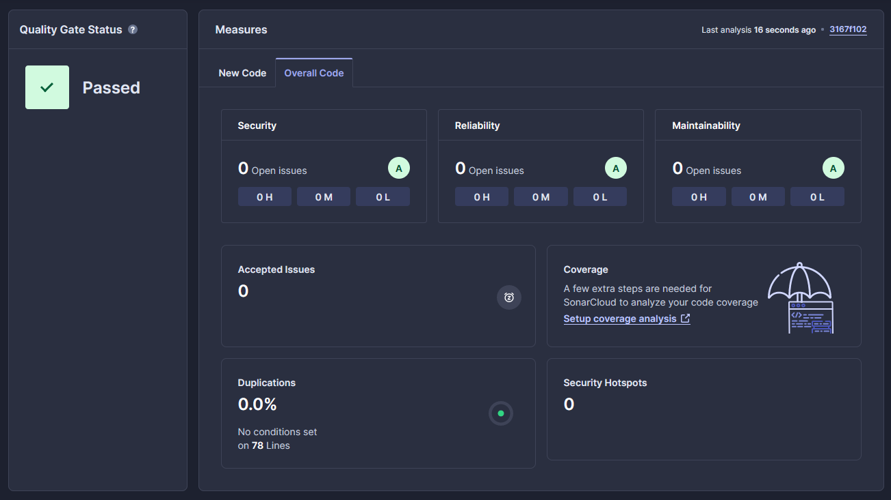

# Zadanie 6

[](https://sonarcloud.io/summary/new_code?id=marekostafin_ebiznes-zadanie7)
[](https://sonarcloud.io/summary/new_code?id=marekostafin_ebiznes-zadanie7)
[](https://sonarcloud.io/summary/new_code?id=marekostafin_ebiznes-zadanie7)

Pliki zadania 6 umieściłem w osobnym repozytorium, ponieważ w ten sposób łatwiej było mi skonfigurować Sonara.

### Na 3.0

Pliki znajdują się tutaj:

https://github.com/marekostafin/ebiznes-zadanie7

Hook, który dodałem ma następujący kod.
```
#!/bin/bash

golangci-lint run

lint_exit_code=$?

if [ $lint_exit_code -ne 0 ]; then
    echo "golangci-lint found issues. Aborting commit."
    exit 1
fi
```
Nagranie ilustrujące jego działanie znajduje się w katalogu z niniejszym README.

### Na 3.5



Po przeskanowaniu repozytorium za pomocą SonarCloud'a, okazało się, że aplikacja nie ma żadnych bugów. 
Podpunkt na 3.5 jest więc spełniony - przechodzę dalej.

### Na 4.0
Na powyższym zrzucie ekranu widać, że w kodzie są 2 zapaszki.
Po poprawieniu ich, analiza wygląda następująco:



Czyli udało się zredukować zapaszki do zera.

### Na 4.5
Na powyższym zrzucie ekranu widać, że nie ma żadnych podatności ani błędów bezpieczeństwa.